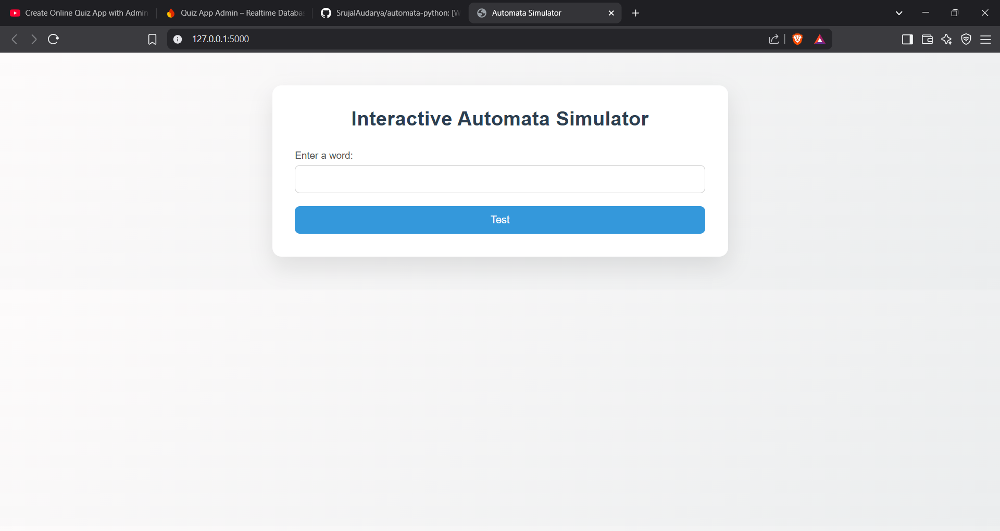
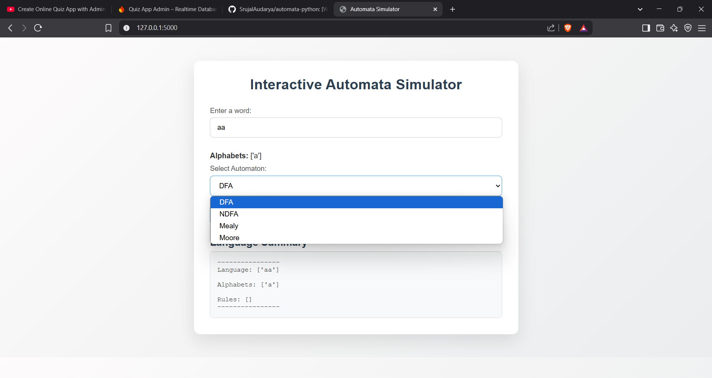
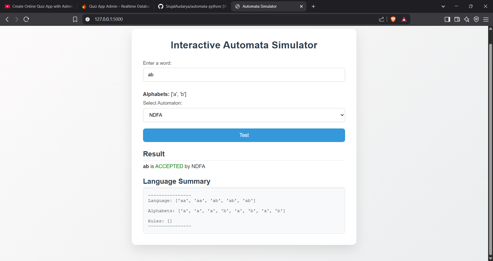
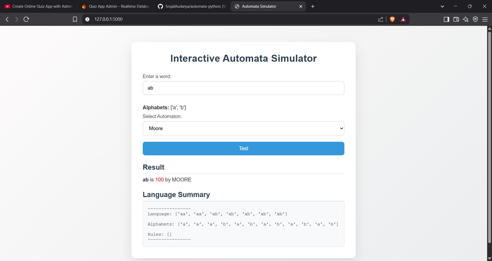

# 🧠 Interactive Automata Simulator

A web-based tool that simulates various types of finite automata — including **DFA**, **NDFA**, **Mealy**, and **Moore machines** — and tracks the formal language formed by user input.

## 🚀 Features

- ✅ Check if a string is accepted by a DFA or NDFA
- 🔁 Generate output from Mealy and Moore machines
- 📖 Track formal language and used alphabets
- 🖥️ Clean web interface with Flask and HTML/CSS
- 📷 Screenshot-based interface demonstration

## 📂 How It Works

1. Enter an input string
2. Select the automaton type (DFA, NDFA, Mealy, Moore)
3. The application processes the string using the selected machine
4. Displays acceptance, rejection, or output string
5. Builds and displays the evolving formal language

## 💻 Technologies Used

- **Python (Flask)**
- **HTML, CSS**
- **JavaScript (optional)**
- **Hosted locally / cloud platform (optional)**

## 📸 Screenshots






## 🏗️ Project Structure

```plaintext
.
├── app.py
├── static/
│   └── style.css
├── templates/
│   └── index.html
├── automata/
│   ├── DFA.py
│   ├── NDFA.py
│   ├── Mealy.py
│   └── Moore.py
├── screenshots/
│   ├── 1.png
│   ├── 2.png
│   ├── 4.png
│   └── 6.png
└── README.md
